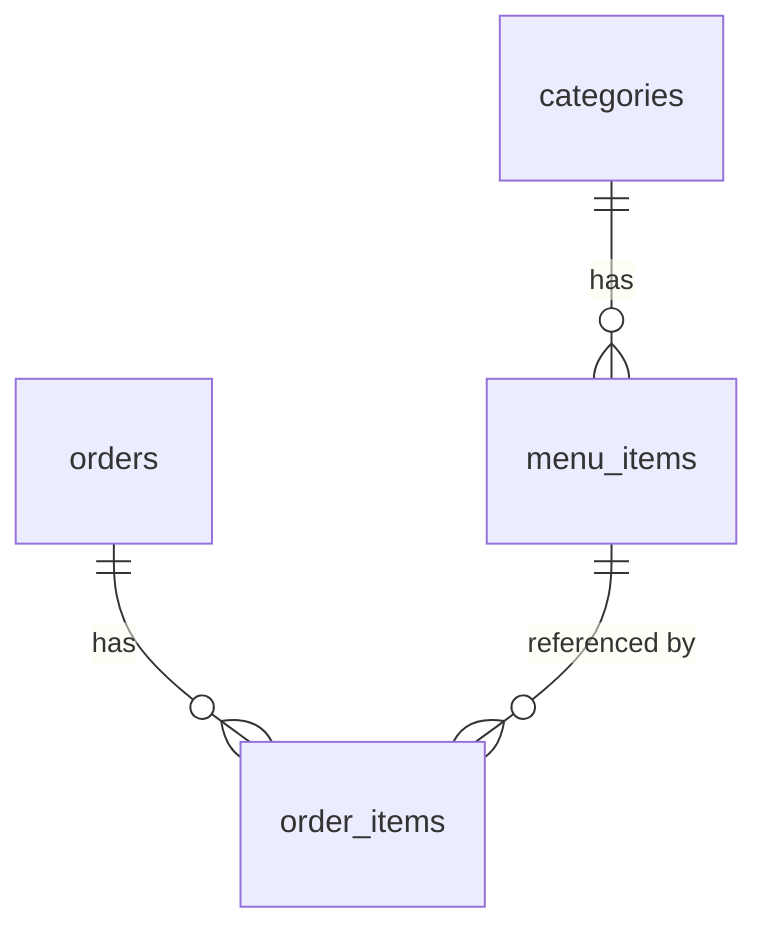
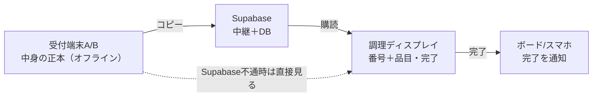
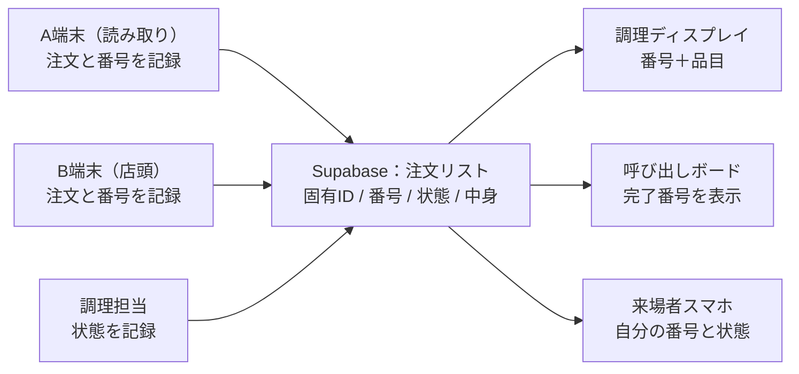

# 文化祭モバイルオーダー 仕様書

*1店舗運用・スマホ注文と店頭注文を同時に走らせる構成の設計仕様。*

---

## 1. 概要

文化祭の1つの模擬店で使う、モバイルオーダーの仕組み。来場者が自分のスマホで注文する経路と、店員が店頭の端末で注文を入力する経路を、同じ会場で同時に動かす。会計は現金、その場払い。

このアプリが解くべき本質的な制約は、突き詰めると **番号の一意性ただ1つ** に集約される。2つの注文経路が、絶対に同じ番号を持ってはいけない。ここさえ守れば、他はかなり自由に組める。

---

## 2. 設計の背骨（この2原則がすべてを貫く）

以降の仕様は、次の2つの原則から導かれている。迷ったらここに立ち返る。

**原則1 — 注文リストは1つ、関係者は全員その眺め。**
中心に小さな注文リストが1つだけあり、A端末・B端末・調理担当・呼び出しボード・来場者スマホは、それぞれこのリストへ書き込む／読み取るだけの存在。番号を発行するのも、番号をスマホに戻すのも、「できた」を伝えるのも、同じリストへの操作にすぎない。

**原則2 — 重いものはオフライン、軽い合図だけネットに乗せる。**
注文内容（品目・数量・金額）やメニュー内容のような重いデータは、来場者の注文行為の経路ではネットワークに乗せず、QRやキャッシュで完結させる。ネットに乗せるのは「番号」「状態」「売り切れ」といった数バイトの軽い合図だけ。会場のWi-Fiは混雑時に不安定になる前提で、通信が細っても細い合図なら通り、最悪落ちても紙や口頭にフォールバックできる。

> **原則2の限定的な緩和：** 調理場へ「中身」を届けるためだけに、注文内容のコピーを裏方（受付端末→Supabase→調理画面）で同期する。これは *来場者が注文を出す行為* を混雑Wi-Fiに依存させないという原則2の核を崩さない。中身の正本は受付端末にオフラインで残り、ネットに乗るのは裏方端末どうしの小さなコピーにすぎない（詳細は §9・§10）。

> 設計の良し悪しは「たくさん捌けるか」ではなく **「ピーク時にネットが不安定でも壊れないか」** で判断する。同時アクセス数はサーバーの負荷にはならない。ボトルネックは常に会場のWi-Fi。

---

## 3. 技術スタック

- **DB・バックエンド：Supabase（確定）**。リレーショナルなスキーマ（§7）と、変更のリアルタイム購読が要件に素直に合う。
- Supabaseの役割は3つ：**①メニュー／注文のDB**、**②変更をリアルタイムに届ける配達経路**（番号・状態・売り切れ・中身のコピー）、**③売上記録の保存**。
- **重要：Supabaseは番号を発行しない。** 番号は各端末がローカルで採番する（§8）。前回はDB側で採番していた可能性が高いが、それは却下した「共有カウンター方式」（ネット必須・混雑時に詰まる）にあたるため、今回は端末ローカルへ移す。ここが前回コードからの最大の作り替えポイント。
- 来場者はログイン不要（認証は使わない）。QRポスターからWebを開くだけ。

---

## 4. 登場人物と端末

| 端末 / 役割 | 台数 | 役割 | 補足 |
|---|---|---|---|
| 来場者スマホ | 人数分 | メニュー選択・QR表示・番号と状態の確認 | ログイン不要 |
| A端末（読み取り） | 1 | スマホ注文のQRをスキャン、会計、採番 | **中身の正本を保持** |
| B端末（店頭） | 1 | 店員が直接注文を入力、会計、採番 | **中身の正本を保持** |
| 調理ディスプレイ | 1 | 番号＋品目を表示、完了を記録 | 調理場に設置 |
| 呼び出しボード | 1 | 完了した番号を一覧表示 | 店先に設置 |

「受付端末」とはA端末・B端末の総称。注文の中身（品目）の正本は、受け付けたこの端末が必ずオフラインで握っている。

---

## 5. 中心のデータモデル：注文リスト

システムの唯一の真実（single source of truth）。1件の注文は最小限、次の項目を持つ。

| 項目 | 内容 | 例 |
|---|---|---|
| 固有ID | 注文を一意に識別するID。**二重防止の冪等キーを兼ねる** | `ord_8f3a...` |
| 番号 | 来場者に見せる呼び出し番号。端末プレフィックス付き | `A-05` / `B-12` |
| 状態 | 注文の進行段階（§6） | `受付 / 調理中 / 完了 / 受け渡し済み / 取消` |

- **固有IDはスマホ側で注文を組むたびに一意生成**し（例：UUID）、QRに含める。同じ固有IDが二度届いても新規注文を作らないことで、二重スキャン・二重同期を防ぐ（§11）。
- 品目・数量・金額などの注文内容は、この最小リストとは別に扱う。正本は受付端末、コピーはSupabaseの `order_items`（§7・§9）。

---

## 6. 注文の状態機械

前進経路と、そこから外れる分岐を定義する。

```
支払い確定 → 受付 →（調理開始）→ 調理中 →（できた）→ 完了 →（渡した）→ 受け渡し済み
                └──────────── 取消（返金・終了）←────────────┘
```

- `調理中` は任意（省略して `受付 → 完了` でもよい）。
- `取消` は `受付 / 調理中 / 完了` のどの段階からでも入れる終端（返金・無効）。監査のため物理削除せず取消として残す。
- **すべての前進は取り消して1つ前へ戻せる**（誤タップ対応）。非エンジニアが操作する前提の必須要件。
- `完了` を押した瞬間が、呼び出しボードへの表示と、スマホへの「できたよ」通知の引き金になる。
- 呼び出しボードは「`完了` かつ 未 `受け渡し済み`」だけを映す。渡し終えたら `受け渡し済み` にして片付ける。

---

## 7. メニュー管理とデータベース設計

運営側が中央DB（Supabase）でメニューをいつでも変更できる。ただしオフライン注文（原則2）と両立させるため、**メニューを2層に分ける**。

- **メニュー内容（準静的）**：品目・名前・価格・カテゴリ・画像。反映は読み込み時／リフレッシュ時でよい。重いのでキャッシュ向き。構造的な編集は主に開店前に行う。
- **在庫（ライブ）**：売り切れフラグ。小さく頻繁で、素早く伝わってほしい。番号・状態と同じ軽量リアルタイム経路に相乗りさせる。当日「いつでも変えたい」の実体は、ほぼこの売り切れ切り替え。

**スナップショット原則：** メニューはいつでも変えられるので、過去の注文が壊れないよう、注文時点の名前と価格を注文側に焼き付ける。うちの設計では注文内容がQRに入って注文の瞬間に固定されるため、これは半ば自動的に満たされる。

### スキーマ

**categories**：id (PK) / name / display_order

**menu_items**

| カラム | 型 | 説明 |
|---|---|---|
| id | PK | 品目ID |
| category_id | FK → categories.id | 所属カテゴリ |
| name | text | 品名 |
| price | int | 価格（円・整数） |
| description / image_url | text? | 任意 |
| display_order | int | 表示順 |
| **is_available** | bool | **売り切れフラグ（ライブ同期）** |
| **is_active** | bool | **ソフトデリート用。物理削除は禁止** |
| created_at / updated_at | timestamp | 監査用 |

**orders**：id (PK, =固有ID) / number / status / created_at

**order_items（＝中身のコピー ＝売上記録）**

| カラム | 型 | 説明 |
|---|---|---|
| id | PK | 明細ID |
| order_id | FK → orders.id | 注文 |
| menu_item_id | FK → menu_items.id（nullable） | 参照のみ |
| name_snapshot / price_snapshot | text / int | 注文時点を焼き付け |
| quantity | int | 数量 |

- `order_items` は、調理画面へ中身を届けるためのコピーであると同時に、そのまま売上記録になる（§9）。
- `is_active = false` で品目を隠す。物理削除は禁止（過去注文の参照を壊さないため）。



---

## 8. 番号の採番ルール（最重要）

- A端末は `A-01, A-02, ...`、B端末は `B-01, B-02, ...` を発行する。端末ごとにプレフィックスで番号帯を完全に分離する。
- 2台は互いに相談しない。**各端末がローカルで独立に採番する**ため、二重採番は原理的に起きない。ネット不要・オフラインでも採番は止まらない。
- **番号発行は「支払い確定」の瞬間だけ。** スキャンは内容のプレビューにすぎず、番号は生まれない。払わず立ち去っても幽霊注文は出ない。
- **実装上の必須注意：** 各端末の「次の番号」は発行のたびに端末側へ**永続保存**する。怠るとリロードやクラッシュで `A-01` に巻き戻り、二重採番が復活する。ここが最も壊れやすい急所（関連する運用ルールは §11）。

---

## 9. フロー詳細

### 9-1. スマホ注文（経路①）

1. 来場者がQRポスターからWebページを開く。
2. カートに商品を追加する。メニューはキャッシュ済みで、**注文の組み立ては完全オフラインで完結**。注文ごとに固有IDを一意生成する。
3. カートの中身＋固有IDをQRコード化して表示する。
4. A端末がQRをスキャンする（オフライン可）。内容を画面にプレビュー表示（この時点では番号は発行しない）。
5. 来場者が現金で支払う。
6. A端末で**支払い完了ボタン**を押す → `A-xx` を発行、注文と中身をSupabaseへ書き込む。
7. 番号（数バイト）が来場者スマホへ届き、画面が番号・状態表示に自動遷移する。戻らないときは §10 のフォールバックへ。

### 9-2. 店頭注文（経路②）

1. 店員がB端末で注文を入力する（固有IDを一意生成）。
2. 来場者が現金で支払う。
3. 支払い完了ボタンで `B-xx` を発行、注文と中身をSupabaseへ書き込む。
4. 来場者には**紙の番号札**を手渡す。

### 9-3. 呼び出し（両経路共通）

1. 調理担当が調理を終え、状態を `完了` にする。
2. 呼び出しボードが `完了` かつ未受け渡しの番号を一覧表示する。
3. 来場者は自分の番号がボードに出たら受け取りに行く。
4. 受け渡したら「渡した」で `受け渡し済み` にして片付ける。（任意）スマホへ「できあがりました」を通知してもよい。

### 9-4. 中身の流れ（キッチン）

支払い確定の瞬間、受付端末が握る中身をSupabaseへコピーする。**調理ディスプレイ**はSupabaseの `受付`（未完了）を購読し、来た順（先入れ先出し）に「番号＋品目」を並べる。調理担当は必要なら `調理中` を、できたら `完了` を押す。



- Supabaseが落ちても中身の正本は受付端末に残るので、調理場は受付端末を直接見て作れる。
- **この中身のコピー（order_items）がそのまま売上記録になる。** デジタル調理画面を選んだ副産物。

### 9-5. 通知（できあがり）

通知は2層。**A：画面内リアルタイム更新（確定・芯は実装済み）**——番号画面を開いていれば、完了の瞬間に「できあがりました」へ自動で変わる。番号を戻す購読がそのまま状態変更も運ぶため、ほぼ追加コストなし。**B：Web Push（採用・任意層）**——画面を閉じていてもスマホに通知を出す。

Bの構成（Supabaseで完結）:

1. **購読のタイミング**：待ち番号画面に着いた瞬間に「受け取り時にお知らせします」と添えて許可を求める（初回読み込みでは求めない）。許可されたらService Workerを登録し、プッシュ購読を作る。
2. **保存**：購読情報を固有IDに紐づけてSupabaseへ保存（`push_subscriptions`：order_id / endpoint / p256dh / auth）。
3. **送信の引き金**：`完了` の状態変更をSupabase Edge Functionが検知し、その固有IDの購読先へVAPID署名付きでプッシュを送る。
4. **受信**：Service Workerが `push` を受け「できあがりました（A-05）」を表示。タップで番号画面へ。

設計上の要点:

- **ボード表示・画面内更新(A)・プッシュ(B)は、すべて `完了` という同じ1イベントからぶら下がる。** 完了を押すだけで3経路が同時に動く。
- **Bは決して主役にしない。** 許可拒否・iOS未対応・送信失敗はすべて静かに諦め、A＋ボードが受け止める。購読は文化祭終了後に破棄してよく、長期管理は不要。
- **到達範囲**：Androidは許可すれば届く。iPhoneはホーム画面に追加した人のみ（追加は主役に据えない任意の導線）。それ以外はA＋ボードで補う。全機種で確実に鳴らしたくなったら、将来LINE通知を足す（§15）。

---

## 10. ネットワークとフォールバック

各工程が、通信状況に対してどこまで耐えるか。

| 工程 | 必要な通信 | ネットが不安定／死んだとき |
|---|---|---|
| 注文の組み立て（スマホ） | 不要（キャッシュ） | 問題なく動く |
| QRスキャン受付（A端末） | 不要 | 問題なく動く |
| 採番（A/B端末） | 不要（ローカル） | 問題なく動く |
| 番号をスマホへ戻す | 軽量 | 購読が主役 → 表示時・再接続時に現在状態を取得（保険）→ それでも来なければ紙で「レジで確認」 |
| 中身を調理場へ届ける | 軽量（裏方コピー） | 受付端末を直接見る |
| できあがり通知（Web Push） | 軽量 | 届かなければ画面内更新(A)＋ボードで補う（Bは非依存） |
| 売り切れの反映 | 軽量 | 直近キャッシュのまま（口頭で補う） |
| 呼び出し（状態の共有） | 軽量 | 口頭／紙札に落ちる |

**呼び出しは三段で劣化する：スマホ通知 → ボード → 口頭で「A-05の方〜」。** 番号を戻す経路も三段で劣化する：**購読（プッシュ）→ 取得（保険）→ 紙**。どの層が落ちても下の層が受け止める。

> Supabaseの購読はつなぎっぱなしの接続なので、電波が細ると切れ、切断中の更新を取りこぼしうる。自動再接続だけに頼らず、画面表示時と再接続時に一度だけ現在状態を取りにいく「保険」を必ず入れる。

---

## 11. エッジケースと運用ルール

**受付の瞬間（最も危険）**
- **二重スキャン**：固有IDを冪等キーにし、同じIDは新規注文を作らず既存の番号を返す。
- **スキャン ≠ 会計**：番号発行は支払い確定の瞬間だけ（§8）。
- **メニューのズレ**：古いキャッシュで売り切れ品を注文 → レジが最後の砦。「ごめん売り切れ」で外す導線を用意。

**呼び出し・受け渡し**
- **受け取りに来ない**：`完了` のまま放置するとボードが詰まる。「渡した」で片付け、ボードは未受け渡しのみ表示。
- **押し間違い**：全遷移を取り消し可能に（§6）。

**番号まわりの運用ルール**
- **当日はリセットしない**（`A-247` でも実害なし）。多日開催なら、前日を完全に閉じてから翌朝リセット。
- **端末交換の落とし穴**：死んだA端末を新品に替えると `A-01` から始まり衝突する。交換時は「最後の番号から再開」か「新プレフィックス（`A2-`）」を運用で決める。ブラウザのストレージ消去も同じ穴。
- **スマホ側タイムアウト**：番号が一定時間戻らなければ無限ローディングにせず「レジで番号を確認してください」に切り替える。

**オフライン → 復帰**
- オフライン中にローカル採番した注文は端末にキューし、復帰時にまとめて同期。その間キッチンへの伝達は受付端末／口頭。二重同期は固有IDが防ぐ。

---

## 12. 画面一覧

| 画面 | 使う人 | 主な役割 |
|---|---|---|
| メニュー／注文画面 | 来場者 | カート追加 → 注文をQR化 |
| 番号・状態画面 | 来場者 | 自分の番号と進行状態を表示（QRから自動遷移） |
| スキャン・会計画面 | A端末 | QR読み取り → プレビュー → 会計 → `A-xx` 発行 |
| 注文入力・会計画面 | B端末 | 品目入力 → 会計 → `B-xx` 発行 |
| 調理ディスプレイ | 調理担当 | 未完了の注文を番号＋品目で表示、`完了` ボタン |
| 呼び出しボード | 全員が見る | 完了かつ未受け渡しの番号を表示 |
| メニュー管理画面 | 運営 | 品目・価格の編集、売り切れ切り替え |

**非エンジニアが操作する前提**なので、受付端末・調理画面は「押し間違えても壊れない」作りを最優先する（誤操作の取り消し、明快で大きなボタン、状態の視認性）。

---

## 13. 全体構造（参考図）



---

## 14. 確定事項まとめ

- 対象：1店舗、スマホ注文と店頭注文を同時運用。守る制約は「番号の一意性」。
- 技術スタックは **Supabase**。番号はDBではなく **端末ローカル採番**（`A-xx` / `B-xx`）。
- 番号発行＝支払い確定の瞬間。スキャンはプレビューのみ。
- **固有ID＝冪等キー**（二重スキャン・二重同期を防ぐ）。スマホ側で一意生成しQRに含める。
- 会計：現金・その場払い。
- 状態機械：`受付 / 調理中 / 完了 / 受け渡し済み / 取消`、全遷移が可逆。物理削除しない。
- メニューは中央DBで管理し、内容（準静的）と在庫（ライブ）の2層に分ける。スナップショットで履歴を守る。
- **調理場にディスプレイを1台**設置。中身は受付端末が正本、Supabase経由で調理画面へ。落ちたら端末を直接見る。
- 中身のコピー（order_items）がそのまま売上記録になる。
- 呼び出し・番号返却ともに三段フォールバック。
- **通知は2層。A：画面内リアルタイム更新（芯は実装済み）。B：Web Push（採用・任意層・非依存）。** 送信はSupabase Edge Function、引き金は `完了`。

---

## 15. 未決事項（残りは「選べばいい」系）

- **全機種で確実に鳴らしたくなったらLINE通知を足すか**（Web Pushの上に将来オプション。連携と友だち追加の導線が増える）。
- **紙のキッチンチケット（プリンタ）を足すか**（デジタル調理画面の上の任意オプション）。
- **QRのスキャン方式**（ブラウザ標準機能かライブラリか）。
- **固有IDの具体的な生成方法**（UUID等）と衝突対策の実装。
- **メニュー管理画面のUX**（専用画面かSupabaseダッシュボード直編集か）。
- **各テーブルの型・制約の最終確定**、当日の番号リセット手順の具体化。
- **VAPIDキーの管理**（Edge Functionのシークレットに秘密鍵、クライアントに公開鍵）。
